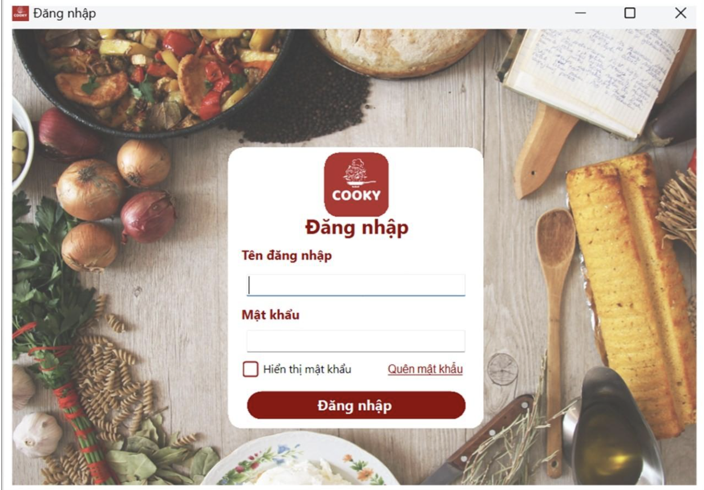
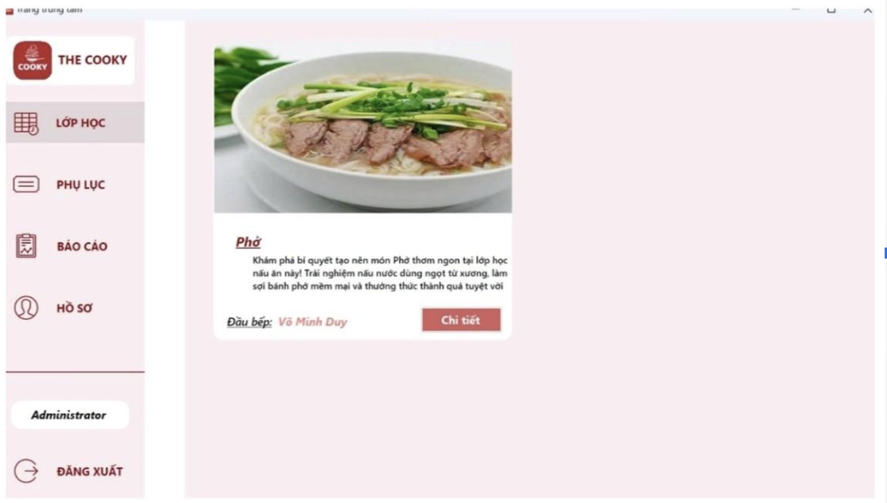
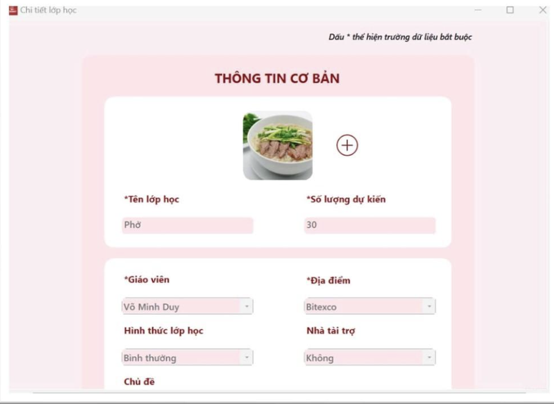
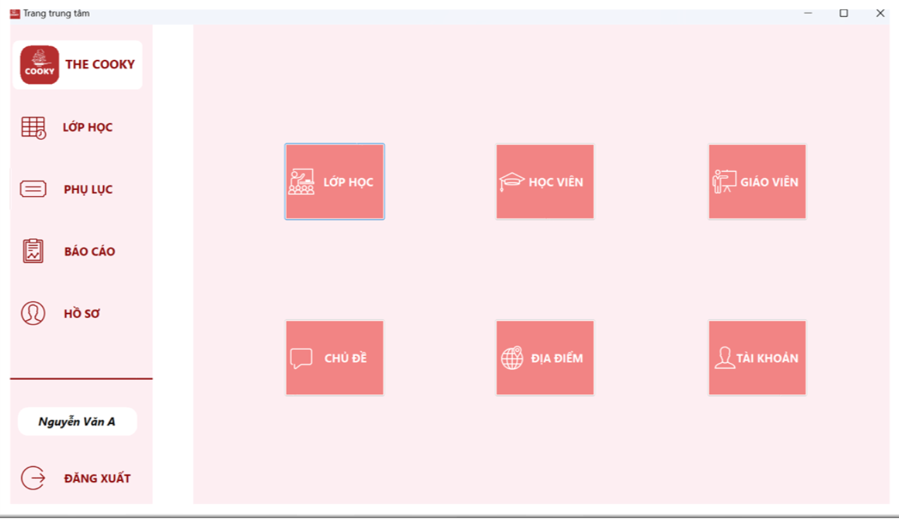
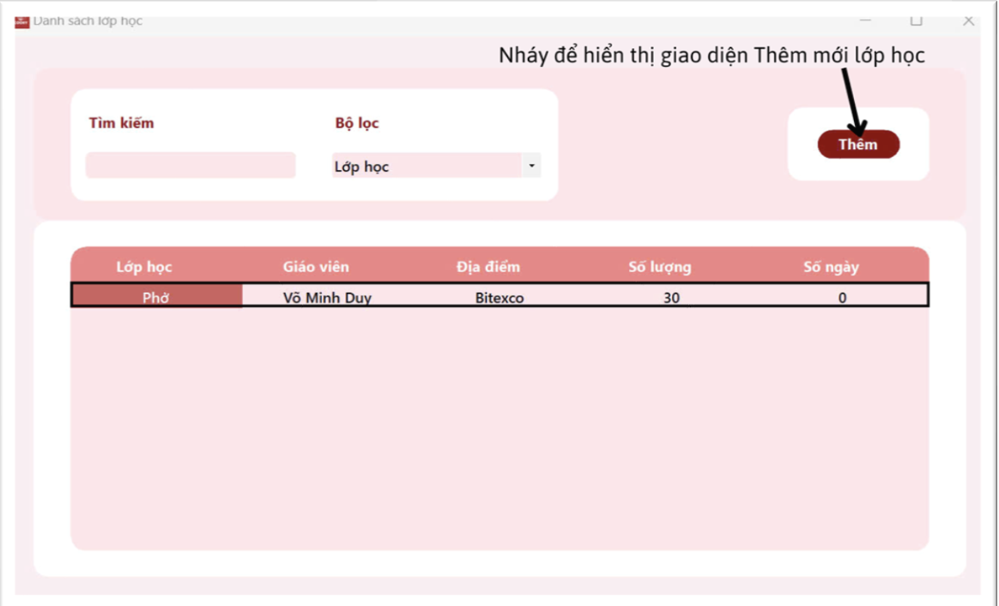
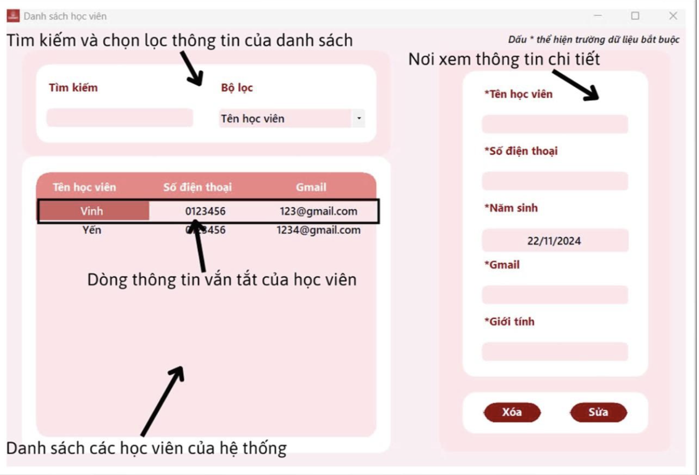
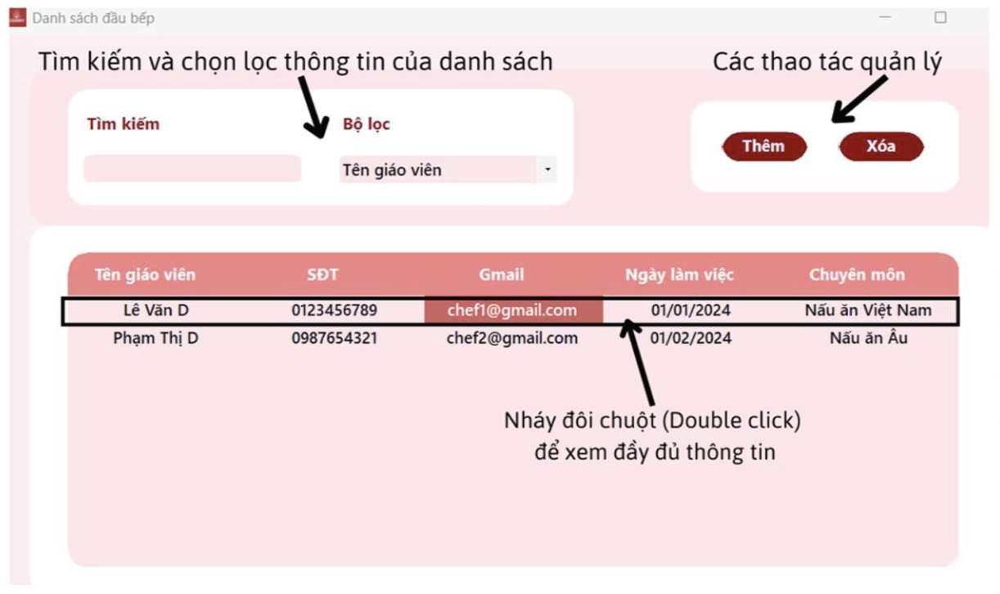
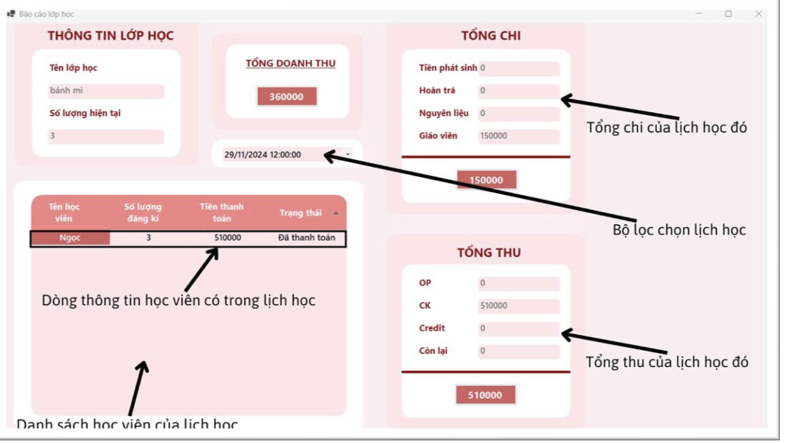

# The Cooky 

**The Cooky** is a comprehensive software solution designed to help businesses manage and operate cooking classes in a professional and efficient manner. The system focuses on simplifying administrative tasks, tracking class activities, and optimizing overall business performance through smart and flexible management tools.

## ✨ Key Features

- **User Account Management:** Manage user accounts with role-based access control.  
  *Only one administrator account is allowed for enhanced security.*

- **Secure Authentication:** Users log in with a username and password. Access is limited to authenticated users.

- **Cooking Class Management:** Create, update, and delete cooking classes; track enrollment, revenue, and class schedules.

- **Instructor Management:** Manage instructor profiles and view their teaching history.

- **Student Management:** Maintain student information and track class registrations.

- **Reports & Statistics:** Generate monthly, quarterly, or yearly reports for performance analysis.

- **Report Exporting:** Export accurate and well-structured reports consistent with system data.

## 🎬 Demo
### Sign In
  
### Homepage
  

### Class Detail
  

  
### Dashboard 
  
### Class Management
  

### Student Management
 

### Teacher Management
 

### Report 

## 🛠️ Tech Stack
- **Programming Language:** C#
- **Platform:** .NET Framework
- **User Interface:** Windows Forms (WinForms)
- **Database:** Microsoft SQL Server

